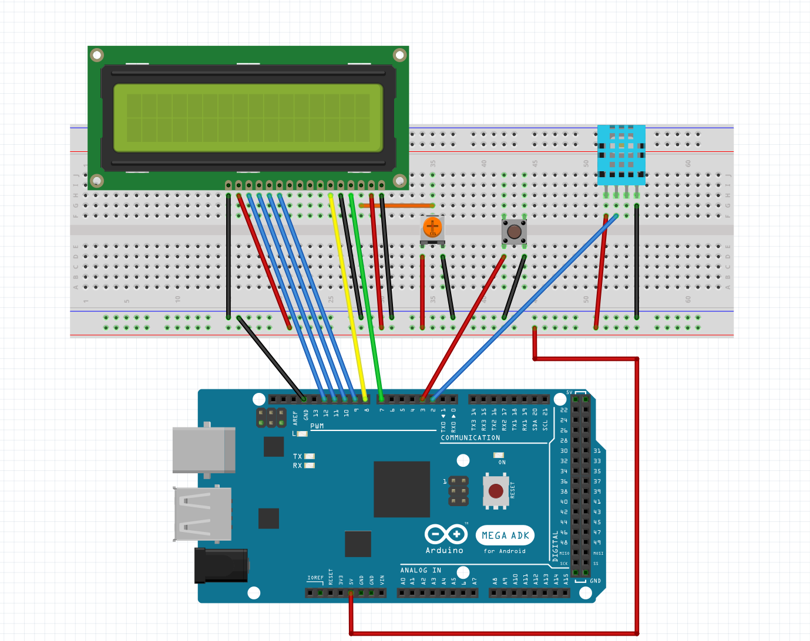

# arduino-temp-humidity-display
# Non-Blocking Environment Monitor
> A responsive room-monitoring display built to read temperature and humidity asynchronously without letting slow sensor hardware freeze the user interface.

## What It Does
This project reads the current temperature and humidity from a digital sensor and displays them on a small LCD screen. There is a single button attached to the project. When you press the button, the screen instantly switches between showing the temperature (in Fahrenheit) and the humidity percentage. 

## Why I Built It
I built this to learn how to write non-blocking code in embedded systems. The problem with many basic electronics projects is that they use a "delay" command to slow things down so the sensor can keep up. However, this freezes the whole system and makes buttons completely unresponsive. I wanted to solve that problem by practicing the "millis" timing technique, allowing a slow sensor and a fast button to live together smoothly on the same chip.

## Hardware Used
- Arduino Mega 2560 (Elegoo Mega Kit)
- DHT11 Temperature & Humidity Sensor
- 16x2 Character LCD Display (with Potentiometer for contrast)
- Tactile Push Button & a 10K Ohm resistor

## Key Technical Decisions
**Why decoupled display updates?** Instead of refreshing the LCD on a fixed timer with the sensor, I split them up. The display updates immediately the exact millisecond the button is pressed. This makes the device feel snappy and responsive, even though the sensor data only updates every 3 seconds.

**Why software debounce instead of hardware?** Rather than adding extra capacitors to the breadboard to clean up the button's electrical noise, I handled it in software using a 50ms time-check window. This keeps the physical build cleaner and lowers the component count.

**Why use an Enum for display states?** Instead of tracking the display mode with a generic integer (like 0 and 1), I used a strongly-typed `DisplayMode_t` enum. This makes the code self-documenting and prevents accidental state bugs if I want to add more sensor types later.

## What I Learned
The hardest part was shifting my mindset away from linear, top-to-bottom programming. Managing separate timers running at different intervals in a single `loop()` function felt like juggling at first. If I were to do this differently, I would use an external hardware interrupt for the button to see how it compares to software polling, and I'd migrate the sensor logic to an explicit state machine.

## Wiring Diagram
